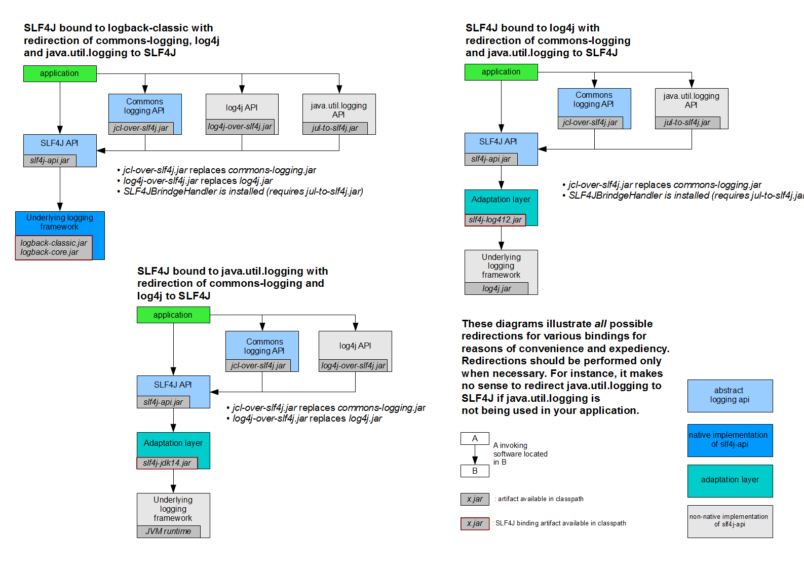
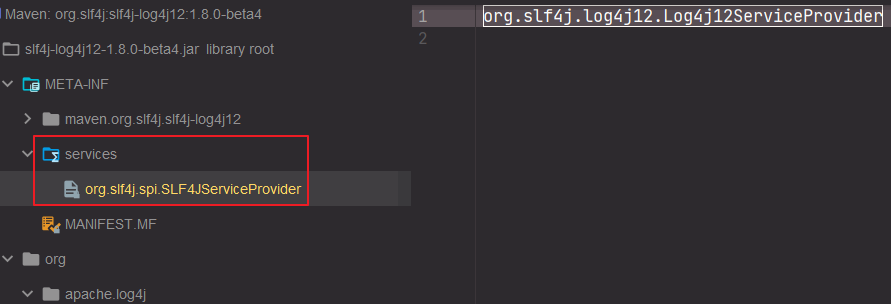

<center>

### <font color=red>Slf4j</font> <!-- {docsify-ignore} -->
</center>

<p align="right">
<a href="http://www.slf4j.org/legacy.html" target="_blank"> 
<font face="Arial" color="green" size="1">| origin-1 |</font>  
</a>
<a href="https://blog.csdn.net/bjchenxu/article/details/108031101" target="_blank"> 
<font face="Arial" color="green" size="1">| origin-2 | </font>   
</a>
<a href="https://albenw.github.io/posts/e31dfd0e/" target="_blank"> 
<font face="Arial" color="green" size="1">| origin-3 | </font>   
</a>
</p>

> ##### <font color=green>Overview</font>

Simple Logging Facade for Java 是由 Ceki Gulcu 设计的一个日志抽象层. Ceki Gulcu 是 Log4j 的前作者, 
当时与 Apache 在定义日志抽象定义时意见不合, 因此离开 Apache 并且推出 Slf4j, 同时提供了具体日志实现 Logback;
目前 Spring Boot 内置日志框架就是 Slf4j + Logback.

> ##### <font color=green>Slf4j Framework</font>

对于新项目而言, 我们可以直接选择 Slf4j + Logback 来控制日志, 但是, 对于遗留项目, 我们就需要维护不同的日志框架;
因此, 为了统一这些日志框架的调用, Ceki Gulcu 又提供了一个桥接层来把这些不同的日志框架重定向到 Slf4j, 经过 Slf4j 之后,
就进入了适配层, 会自动选择 JUL, Log4j, JCL 等具体实现的日志框架. 而 Logback 本就是 Slf4j 默认实现, 
因此也不需要 Slf4j-xx 来适配.


> ##### <font color=green>Bridge & Adapt</font>
 
如图所示, 可以通过不同的 jar 包来实现其他日志框架桥接到 Slf4j, 同时指定具体的日志框架作为 Sl4j 的具体实现.

因此, 最复杂的一种情况, 我们的系统中分别使用了 JCL, Log4j, JUL 三种不同的日志实现, 这时只需要引入三种对应的 jar
就可以把所有日志请求统一委托到 Slf4j 中处理.

- Bridge
  - jcl-over-slf4j: 把 Jakarta Commons Logging 委托到 Slf4j
  - log4j-over-slf4j: 把 Log4j 委托到 Slf4j
  - jul-to-slf4j: 把 JUL 委托到 Slf4j

当我们系统已经在使用 Slf4j, 但是某些特殊情况, 有需要采用指定的日志实现, 这时候我们可以通过引入下列对应的 jar
来指定 Slf4j 使用对应的日志实现.

- Adapt
  - slf4j-jcl: 把请求到 Slf4j 的日志委托到 JCL 来处理
  - slf4j-log4j12: 把请求到 Slf4j 的日志委托到 log4j 来处理
  - slf4j-jdk14: 把请求到 Slf4j 的日志委托到 JUL 来处理
    


> ##### <font color=green>Infinite Loop</font>

在使用 Slf4j 的时候, 要注意 jar 包的循环依赖问题, 当引入了同一种日志框架的桥接和适配 jar 会造成无线循环, 
如下图: 在使用 Slf4j 的时候, 同时引入了 log4j-over-slf4j 和 slf4j-log4j12.


这时就会导致 StackOverflowError:

```text
SLF4J: Detected both log4j-over-slf4j.jar AND bound slf4j-log4j12.jar on the class path, preempting StackOverflowError. 
SLF4J: See also http://www.slf4j.org/codes.html#log4jDelegationLoop for more details.
Exception in thread "main" java.lang.ExceptionInInitializerError
	at org.slf4j.impl.StaticLoggerBinder.<init>(StaticLoggerBinder.java:72)
	at org.slf4j.impl.StaticLoggerBinder.<clinit>(StaticLoggerBinder.java:45)
	at org.slf4j.LoggerFactory.bind(LoggerFactory.java:150)
	at org.slf4j.LoggerFactory.performInitialization(LoggerFactory.java:124)
	at org.slf4j.LoggerFactory.getILoggerFactory(LoggerFactory.java:417)
	at org.slf4j.LoggerFactory.getLogger(LoggerFactory.java:362)
	at org.slf4j.LoggerFactory.getLogger(LoggerFactory.java:388)
	at ta.main(ta.java:12)
```

!> **<font color=red>因此, 需要避免同一时间出现下列组合:</font>**

- jcl-over-slf4j 和 slf4j-jcl
- log4j-over-slf4j 和 slf4j-log4j12
- jul-to-slf4j 和 slf4j-jdk14

> ##### <font color=green>Adapt Logic</font>

Slf4j 使用的时门面模式, 只提供接口而没有具体实现, 而对于不同的日志实现, Slf4j 是通过不同的适配包, 来完成实际调用,
具体适配逻辑如下:

- **Logger**

我们使用 Slf4j 的 LoggerFactory 获取 Logger 对象:
```java
import org.slf4j.Logger;
import org.slf4j.LoggerFactory;

public class Demo {
    private Logger logger = LoggerFactory.getLogger(Demo.class);
    // ... ...
}
```

- **LoggerFactory**

LoggerFactory 是 ILoggerFactory 的一个 wrapper 类, 主要功能是为不同日志框架 (log4j, logback and JDK 1.4 logging),
提供具体的绑定逻辑, 在编译时期会 Slf4j 会找到具体实现日志的 xxxLoggerFactory.
```java
public final class LoggerFactory {

    // ... ...
    
    public static Logger getLogger(Class<?> clazz) {
        Logger logger = getLogger(clazz.getName());
        if (DETECT_LOGGER_NAME_MISMATCH) {
            Class<?> autoComputedCallingClass = Util.getCallingClass();
            if (autoComputedCallingClass != null && nonMatchingClasses(clazz, autoComputedCallingClass)) {
                Util.report(String.format("Detected logger name mismatch. Given name: \"%s\"; computed name: \"%s\".", logger.getName(),
                        autoComputedCallingClass.getName()));
                Util.report("See " + LOGGER_NAME_MISMATCH_URL + " for an explanation");
            }
        }
        return logger;
    }

    public static Logger getLogger(String name) {
        ILoggerFactory iLoggerFactory = getILoggerFactory();
        return iLoggerFactory.getLogger(name);
    }
}
```

- **GetILoggerFactory**

LoggerFactory 是关键, 这里通过双重检查锁机制保证只初始化一次, 当初始化完成之后的状态为 SUCCESSFUL, 
则通过 StaticLoggerBinder 获取到具体的 LoggerFactory; 那么关键就在于 StaticLoggerBinder 的初始化. 
```java
public final class LoggerFactory {

    // ... ...

    public static ILoggerFactory getILoggerFactory() {
        if (INITIALIZATION_STATE == UNINITIALIZED) {
            synchronized (LoggerFactory.class) {
                if (INITIALIZATION_STATE == UNINITIALIZED) {
                    INITIALIZATION_STATE = ONGOING_INITIALIZATION;
                    performInitialization();
                }
            }
        }
        switch (INITIALIZATION_STATE) {
            case SUCCESSFUL_INITIALIZATION:
                return StaticLoggerBinder.getSingleton().getLoggerFactory();
            case NOP_FALLBACK_INITIALIZATION:
                return NOP_FALLBACK_FACTORY;
            case FAILED_INITIALIZATION:
                throw new IllegalStateException(UNSUCCESSFUL_INIT_MSG);
            case ONGOING_INITIALIZATION:
                return SUBST_FACTORY;
        }
        throw new IllegalStateException("Unreachable code");
    }

    // initial
    private final static void performInitialization() {
        bind();
        if (INITIALIZATION_STATE == SUCCESSFUL_INITIALIZATION) {
            versionSanityCheck();
        }
    }
}    
```

- **Bind**

初始化最终会走到 bind 方法, 这里绑定了具体 StaticLoggerBinder, 编译时期自动寻找 classpath 下面所有符合条件的 
StaticLoggerBinder 单例类, 然后修改初始化状态为 SUCCESSFUL_INITIALIZATION.
```java
public final class LoggerFactory {

    // ... ...

    private static String STATIC_LOGGER_BINDER_PATH = "org/slf4j/impl/StaticLoggerBinder.class";

    private final static void bind() {
        try {
            Set<URL> staticLoggerBinderPathSet = null;
            // skip check under android, see also
            // http://jira.qos.ch/browse/SLF4J-328
            if (!isAndroid()) {
                staticLoggerBinderPathSet = findPossibleStaticLoggerBinderPathSet();
                reportMultipleBindingAmbiguity(staticLoggerBinderPathSet);
            }
            // the next line does the binding
            StaticLoggerBinder.getSingleton();
            INITIALIZATION_STATE = SUCCESSFUL_INITIALIZATION;
            reportActualBinding(staticLoggerBinderPathSet);
            fixSubstituteLoggers();
            replayEvents();
            // release all resources in SUBST_FACTORY
            SUBST_FACTORY.clear();
        } catch (Exception e) {
            
            // ... ...
            
            failedBinding(e);
            throw new IllegalStateException("Unexpected initialization failure", e);
        }
   }
}
```

- **StaticLoggerBinder**


当执行完初始化, 根据状态 SUCCESSFUL_INITIALIZATION 进去 Switch 块, 利用实际寻找的 StaticLoggerBinder 
来完成获取不同日志的 LoggerFactory, 同时这些 Factory 都实现了 SLF4J 的 ILoggerFactory, 重写了 GetLogger
这样就可以完成适配, 虽然调用了 SLF4J 的 getLogger 方法, 但是内部获取到的都是具体实现日志 Logger. 如: 

**Logback (LoggerContext): StaticLoggerBinder.getSingleton().getLoggerFactory().getLogger()**
```java
public class StaticLoggerBinder implements LoggerFactoryBinder {

    // ... ...

    public static StaticLoggerBinder getSingleton() {
        return SINGLETON;
    }
    // ... ...
    
    public ILoggerFactory getLoggerFactory() {
        if (!initialized) {
            return defaultLoggerContext;
        }

        if (contextSelectorBinder.getContextSelector() == null) {
            throw new IllegalStateException("contextSelector cannot be null. See also " + NULL_CS_URL);
        }
        return contextSelectorBinder.getContextSelector().getLoggerContext();
    }
}

public class LoggerContext extends ContextBase implements ILoggerFactory, LifeCycle {
    
    // ... ...

    @Override
    public final Logger getLogger(final String name) {
        // ... ...
    }
}
```

**JDK14LoggerFactory: StaticLoggerBinder.getSingleton().getLoggerFactory().getLogger()**
```java
public class StaticLoggerBinder implements LoggerFactoryBinder {
    private final ILoggerFactory loggerFactory;

    // ... ...

    public static final StaticLoggerBinder getSingleton() {
        return SINGLETON;
    }
    // ... ...
    
    private StaticLoggerBinder() {
        loggerFactory = new org.slf4j.impl.JDK14LoggerFactory();
    }

    public ILoggerFactory getLoggerFactory() {
        return loggerFactory;
    }
}

public class JDK14LoggerFactory implements ILoggerFactory {

    // ... ...

    public Logger getLogger(String name) {
        // ... ...
    }
}
```

**Log4jLoggerFactory: StaticLoggerBinder.getSingleton().getLoggerFactory().getLogger()**
```java
public class StaticLoggerBinder implements LoggerFactoryBinder {
    private final ILoggerFactory loggerFactory;

    // ... ...

    public static final StaticLoggerBinder getSingleton() {
        return SINGLETON;
    }
    // ... ...
    
    private StaticLoggerBinder() {
        loggerFactory = new Log4jLoggerFactory();
        try {
            @SuppressWarnings("unused")
            Level level = Level.TRACE;
        } catch (NoSuchFieldError nsfe) {
            Util.report("This version of SLF4J requires log4j version 1.2.12 or later. See also http://www.slf4j.org/codes.html#log4j_version");
        }
    }

    public ILoggerFactory getLoggerFactory() {
        return loggerFactory;
    }
}

public class Log4jLoggerFactory implements ILoggerFactory {
    
    // ... ...

    public Logger getLogger(String name) {
        // ... ...
    }    
}
```

> ##### <font color=green>Slf4j Report</font>

这里额外关注几个方法, 关于 Slf4j 中寻找具体实现的时候, 会对结果做出 report:

- findPossibleStaticLoggerBinderPathSet: 通过classloader 寻找到所有 StaticLoggerBinder.class 文件 (JVM 
  是允许 classpath 存在多个同样全限定名的类, 此外 JVM 是检索顺序是从前往后, 最终, 会加载顺序在前的类信息.)
```java
public final class LoggerFactory {

    // ... ...
    
    static Set<URL> findPossibleStaticLoggerBinderPathSet() {
        // use Set instead of list in order to deal with bug #138
        // LinkedHashSet appropriate here because it preserves insertion order
        // during iteration
        Set<URL> staticLoggerBinderPathSet = new LinkedHashSet<URL>();
        try {
            ClassLoader loggerFactoryClassLoader = LoggerFactory.class.getClassLoader();
            Enumeration<URL> paths;
            if (loggerFactoryClassLoader == null) {
                paths = ClassLoader.getSystemResources(STATIC_LOGGER_BINDER_PATH);
            } else {
                paths = loggerFactoryClassLoader.getResources(STATIC_LOGGER_BINDER_PATH);
            }
            while (paths.hasMoreElements()) {
                URL path = paths.nextElement();
                staticLoggerBinderPathSet.add(path);
            }
        } catch (IOException ioe) {
            Util.report("Error getting resources from path", ioe);
        }
        return staticLoggerBinderPathSet;
    }
}
```

- reportMultipleBindingAmbiguity: 当发现多个 StaticLoggerBinder 时候打印错误日志.
```java
public final class LoggerFactory {

    // ... ...

    private static void reportMultipleBindingAmbiguity(Set<URL> binderPathSet) {
        if (isAmbiguousStaticLoggerBinderPathSet(binderPathSet)) {
            Util.report("Class path contains multiple SLF4J bindings.");
            for (URL path : binderPathSet) {
                Util.report("Found binding in [" + path + "]");
            }
            Util.report("See " + MULTIPLE_BINDINGS_URL + " for an explanation.");
        }
    }
}
```

- reportActualBinding: 打印最终绑定的 StaticLoggerBinder 信息.
```java
public final class LoggerFactory {

    // ... ...

    private static void reportActualBinding(Set<URL> binderPathSet) {
        // binderPathSet can be null under Android
        if (binderPathSet != null && isAmbiguousStaticLoggerBinderPathSet(binderPathSet)) {
            Util.report("Actual binding is of type [" + StaticLoggerBinder.getSingleton().getLoggerFactoryClassStr() + "]");
        }
    }
}
```

- 当 pom 依赖中引入多个日志实现:
```xml
<!-- ... -->
<dependencies>
    <dependency>
        <groupId>ch.qos.logback</groupId>
        <artifactId>logback-classic</artifactId>
    </dependency>

    <dependency>
        <groupId>org.slf4j</groupId>
        <artifactId>slf4j-log4j12</artifactId>
    </dependency>

    <dependency>
        <groupId>org.slf4j</groupId>
        <artifactId>slf4j-jdk14</artifactId>
    </dependency>
</dependencies>
<!-- ... -->
```

- 启动应用时 SLF4J 会打印错误日志 multiple SLF4J bindings 以及 Actual binding:
```text
SLF4J: Class path contains multiple SLF4J bindings.
SLF4J: Found binding in [jar:file:/C:/Domain/Maven/repository/ch/qos/logback/logback-classic/1.2.3/logback-classic-1.2.3.jar!/org/slf4j/impl/StaticLoggerBinder.class]
SLF4J: Found binding in [jar:file:/C:/Domain/Maven/repository/org/slf4j/slf4j-log4j12/1.7.30/slf4j-log4j12-1.7.30.jar!/org/slf4j/impl/StaticLoggerBinder.class]
SLF4J: Found binding in [jar:file:/C:/Domain/Maven/repository/org/slf4j/slf4j-jdk14/1.7.30/slf4j-jdk14-1.7.30.jar!/org/slf4j/impl/StaticLoggerBinder.class]
SLF4J: See http://www.slf4j.org/codes.html#multiple_bindings for an explanation.
SLF4J: Actual binding is of type [ch.qos.logback.classic.util.ContextSelectorStaticBinder]
```

- 当 pom 依赖中只引入门面, 而没有具体实现的时候:
```xml
<!-- ... -->
<dependencies>
    <dependency>
        <groupId>org.slf4j</groupId>
        <artifactId>slf4j-api</artifactId>
    </dependency>
</dependencies>
<!-- ... -->
```

- 启动应用时 SLF4J 会捕捉 NoClassDefFoundError, 会打印错误日志没有具体日志实现 :
```text
SLF4J: Failed to load class "org.slf4j.impl.StaticLoggerBinder".
SLF4J: Defaulting to no-operation (NOP) logger implementation
SLF4J: See http://www.slf4j.org/codes.html#StaticLoggerBinder for further details.
```

> ##### <font color=green>Slf4j Dummy Class</font>

通过上述可以发现, Slf4j 是通过寻找 classpath 下的 StaticLoggerBinder 来完成具体实现日志框架的绑定, 
但是, slf4j-api 这个门面本身的源码中也会有一个 StaticLoggerBinder 类, 也就是一个假的类来占位,
为什么不会绑定这个 dummy 的类呢?


```java
public class StaticLoggerBinder {
    private static final StaticLoggerBinder SINGLETON = new StaticLoggerBinder();
    
    // ... ...

    private StaticLoggerBinder() {
        throw new UnsupportedOperationException("This code should have never made it into slf4j-api.jar");
    }

    public ILoggerFactory getLoggerFactory() {
        throw new UnsupportedOperationException("This code should never make it into slf4j-api.jar");
    }
    
    // ... ...
}
```

打开源码查看 pom 配置, 可以发现在打包的时候, 删除了这个 dummy 的类:
```xml
<!-- ... -->
<plugins>
    <plugin>
        <groupId>org.apache.maven.plugins</groupId>
        <artifactId>maven-antrun-plugin</artifactId>
        <executions>
            <execution>
                <phase>process-classes</phase>
                <goals>
                    <goal>run</goal>
                </goals>
            </execution>
        </executions>
        <configuration>
            <tasks>
                <echo>Removing slf4j-api's dummy StaticLoggerBinder and StaticMarkerBinder</echo>
                <delete dir="target/classes/org/slf4j/impl"/>
            </tasks>
        </configuration>
    </plugin>
</plugins>
<!-- ... -->
```

> ##### <font color=green>Slf4j Service Provider Interface</font>

上面我们了解到, Slf4j 是通过 ClassLoader 寻找绑定具体的 StaticLoggerBinder, 此外, 还需要在打包的时候, 
通过 mvn 插件删除 dummy 数据; 而在新的 Slf4j 版本中, 是通过 java 提供的 SPI 机制来完成具体绑定, 这样就避免了,
使用 dummy StaticLoggerBinder 以及打包等额外配置.

- pom 中引入新版本的依赖: 
```xml
<!-- ... -->
<dependencies>
    <dependency>
        <groupId>org.slf4j</groupId>
        <artifactId>slf4j-api</artifactId>
        <version>1.8.0-beta4</version>
    </dependency>

    <dependency>
        <groupId>ch.qos.logback</groupId>
        <artifactId>logback-classic</artifactId>
        <version>1.3.0-alpha5</version>
    </dependency>

    <dependency>
        <groupId>org.slf4j</groupId>
        <artifactId>slf4j-log4j12</artifactId>
        <version>1.8.0-beta4</version>
    </dependency>

    <dependency>
        <groupId>org.slf4j</groupId>
        <artifactId>slf4j-jdk14</artifactId>
        <version>1.8.0-beta4</version>
    </dependency>
</dependencies>
<!-- ... -->
```

- bind 流程与之前流程相似, 只是寻找具体的实现框架时, 利用 SPI 机制查找;  可以看出利用 ServiceLoader 
  获取所有实现 SLF4JServiceProvider 接口的日志框架, 取出第一个为实际的 PROVIDER.
```java
public final class LoggerFactory {
    // ... ...

    private final static void bind() {
        try {
            List<SLF4JServiceProvider> providersList = findServiceProviders();
            reportMultipleBindingAmbiguity(providersList);
            if (providersList != null && !providersList.isEmpty()) {
                PROVIDER = providersList.get(0);
                PROVIDER.initialize();
                INITIALIZATION_STATE = SUCCESSFUL_INITIALIZATION;
                reportActualBinding(providersList);
                fixSubstituteLoggers();
                replayEvents();
                SUBST_PROVIDER.getSubstituteLoggerFactory().clear();
            }
            // ... ...
        } catch (Exception e) {
            failedBinding(e);
            throw new IllegalStateException("Unexpected initialization failure", e);
        }
    }

    private static List<SLF4JServiceProvider> findServiceProviders() {
        ServiceLoader<SLF4JServiceProvider> serviceLoader = ServiceLoader.load(SLF4JServiceProvider.class);
        List<SLF4JServiceProvider> providerList = new ArrayList<SLF4JServiceProvider>();
        for (SLF4JServiceProvider provider : serviceLoader) {
            providerList.add(provider);
        }
        return providerList;
    }
}
```

- LogbackServiceProvider


```java
public class LogbackServiceProvider implements SLF4JServiceProvider {
    public static String REQUESTED_API_VERSION = "1.8.99"; // !final

    private LoggerContext defaultLoggerContext;
    private IMarkerFactory markerFactory;
    private MDCAdapter mdcAdapter;
    
    // ... ...

    @Override
    public void initialize() {
        defaultLoggerContext = new LoggerContext();
        defaultLoggerContext.setName(CoreConstants.DEFAULT_CONTEXT_NAME);
        initializeLoggerContext();
        markerFactory = new BasicMarkerFactory();
        mdcAdapter = new LogbackMDCAdapter();
        //initialized = true;
    }
}

```

- JULServiceProvider


```java
public class JULServiceProvider implements SLF4JServiceProvider {
    // ... ...

    public void initialize() {
        this.loggerFactory = new JDK14LoggerFactory();
        this.markerFactory = new BasicMarkerFactory();
        this.mdcAdapter = new BasicMDCAdapter();
    }
}
```

- Log4j12ServiceProvider



```java
public class Log4j12ServiceProvider implements SLF4JServiceProvider {
    // ... ...

    @Override
    public void initialize() {
        loggerFactory = new Log4jLoggerFactory();
        markerFactory = new BasicMarkerFactory();
        mdcAdapter = new Log4jMDCAdapter();
    }
}
```

如上, 在 1.8.0-beta4 版本已经使用 SPI 完成门面和具体实现的绑定, 同时也更加符合面向接口编程的范式.

> ##### <font color=green>Reference</font>

**<font color=green face="Microsoft Sans Serif">原文链接: [origin-1][1] / [origin-2][2] / [origin-3][3]</font>**


[1]: http://www.slf4j.org/legacy.html "1"
[2]: https://blog.csdn.net/bjchenxu/article/details/108031101 "2"
[3]: https://albenw.github.io/posts/e31dfd0e/ "3"

